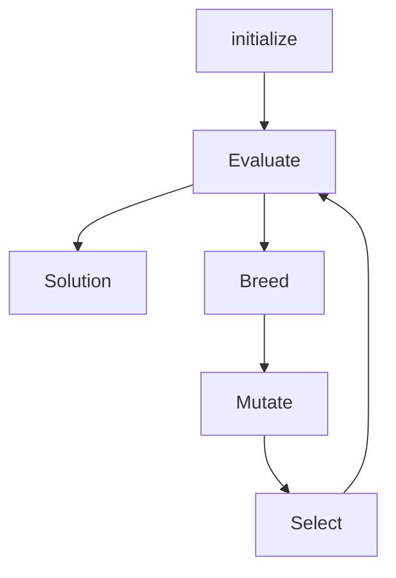

<Titler title="Evolutionary Algorithms" page="8"/>

### Inspired by natural selection:

Define:
* *Entities*: possible solutions to your optimization problem
* *Operators*: how to mutate, breed, ... entities
* *Score evaluator*: your objective function

Then:
* iterate to simulate evolution
* select the fittest entities
* continue until satisfied

